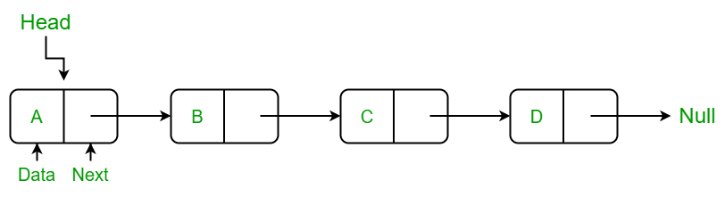

# Practice problems

#### I have given you 4 sections in the repo. The first is the practice problems, a timer class, and arraylist class, and a linked list class.
## Part 1: Questions
#### This section in the Questions file has simple practice problem to solve.

## Part 2: Timer Class
* So this one is a little different. Here, you should go into Timer.java file to fill out an all the methods laid out. All the prompts are in the file itself.

## Part 3: ArrayLists
* Here I would like you to make an arraylist from scratch. Your code should be able to fulfill the basic uses of the ArrayList you have seen.
* The code also goes over Generics in java. If you don't know what those are there are examples in the code and you may ask me about it or do your own research. Essentially think of them as placeholders for the datatype you want to use in code.

## Part 4: Linked Lists
* Good news, there's no work to be done here! I've already done the work all you have to do is review it.
* This introduces linked lists, a type of data structure where each member points to the next one, like the picture below
* The code in the LinkedList and Node files show how to make a linked lists and how to se generics with it.
 

 
* #### Essentially a linked list holds nodes. Each node has data and a pointer to the next node in the list. 
